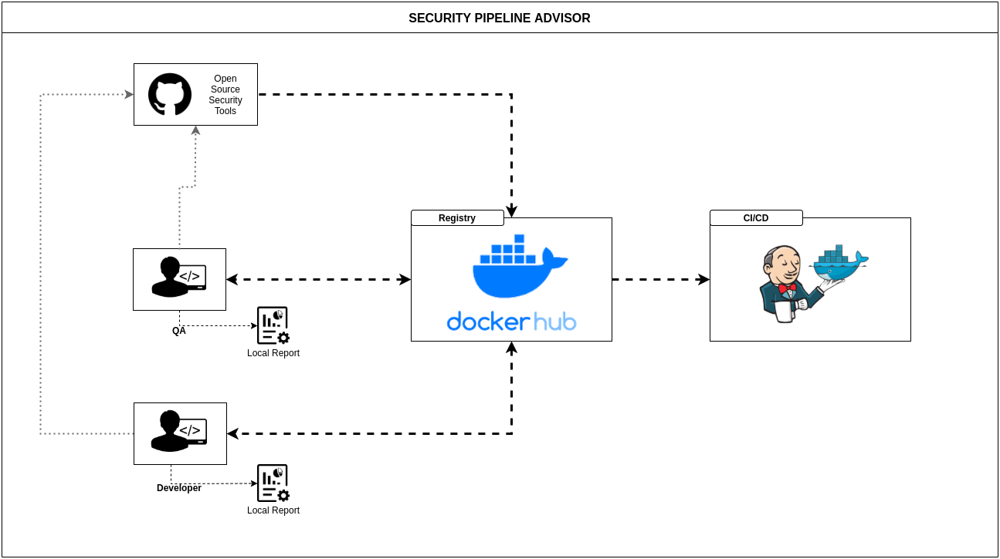
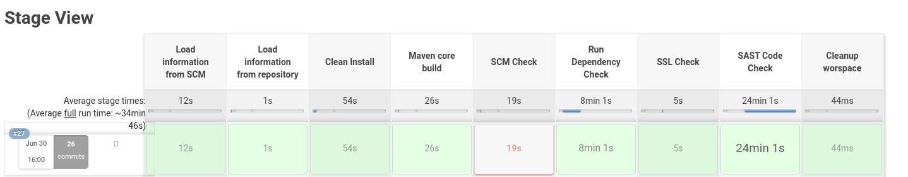
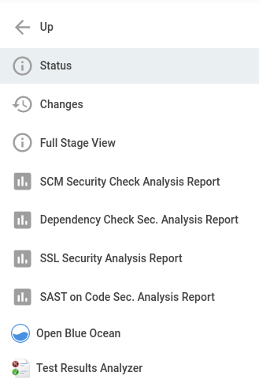

# secure-pipeline-advisor
This project allows you to improve your code security by running different security checks/validation in a simple way. It runs on different languages, and you can also integrate with popular CI/CD tools.

## Purpose
* Run essential security check/analysis in a single container
* Simplify integration of security tools with most popular CI/CD tools
* Help improve application security with automated results

## What validations are performed by this project?
* **Git Secrets** - find out possible credential leaks on code;
* **Dependency Check** - detects publicly disclosed vulnerabilities in application dependencies;
* **SSL Scanning** - analyze the SSL/TLS configuration of a server;
* **Static Code Analysis** - analyse applications's source code;
* **Automated Functional Penetration Testing** - custom security tests  ==WIP==


## Solution / Architecture
<br />


### Tools
* [GitLeaks](https://github.com/zricethezav/gitleaks)
* [SSLyze](https://github.com/nabla-c0d3/sslyze)
* [Find-Security-Bugs](https://find-sec-bugs.github.io/)
* [Owasp-Dependency-Check](https://owasp.org/www-project-dependency-check/)
* [Serenity-BDD](https://github.com/serenity-bdd)


## Support

### Project languages supported
|Language   |Integration Status |
|---	    |:-:	            |
|Java       |Done               |
|JavaScript |Work in progress   |
|TypeScript |Work in progress   |
|C#         |Planned            |
|Kotlin     |Planned            |

### List of status of integration with CI/CD tools
|Tool           |Integration Status |
|---	        |:-:	            |
|Jenkins        |Done               |
|GitLab CI      |Work in progress   |
|Bamboo         |Planned            |
|Azure DevOps   |Planned            |

## Usage
It is possible to run the security tests from the script, or from scratch using docker instructions described below.

### Language Requirements
For some of the checks, to validate in some languages you have first to build the project properly, so below are the requirements for the each language current supported:

#### Java
Run the following commands in your project:
```
mvn clean install
```
then
```
mvn compile package
```

#### Script requirements
* Docker Engine (>= 19.03.0)
* docker-compose (>= 1.26.0)
* A shell script executor _(for those using Windows)_

#### Running the script
To perform the checks by using the script is a pretty simple task, just run the commands described below:

`chmod +x run-sec-advisor.sh` - it will allow the script to be executed

`./run-sec-advisor.sh` - it will start the script and show you the available options

After that the script will present all the options allowed to you, so you can just type the desired option and the script will do all the action for you.

#### Report generation
After every check a report will be generated by the analysis/checking performed, and will be stored at the folder 'job-reports', created on the current folder of this project. Just access '/job-reports' and look for the report generated by your analysis/check.

Every report generated by the script run will have the time and date of the test execution in the report name, so you can keep the history of all the analysis and/or checks that you want.

### Local execution (using pure Docker)

#### Requirements
* Docker Engine

#### Running tests
By following the examples below you can easily run your security checks with the usage of pure Docker.

##### Repository checks
`docker run -v $(pwd)/job-reports:/opt/job-reports -it ralves20/sec-tests:1.0 sh -c "gitleaks --path <repository path> -v --report=/opt/job-reports/gitleaksreport.json"` - it will run the checking for vulnerabilities and secrets of git.

##### SSL Checks
`bash docker run -v $(pwd)/job-reports:/opt/job-reports -it ralves20/sec-tests:1.0 sh -c "sslyze <Application's IP or DNS> --json_out=/opt/job-reports/sslyze-analysis.json"` - it will run ssl/tls analysis in the application in testing.

##### Project's dependency-check
`docker run -v $(pwd)/job-reports:/opt/job-reports -it ralves20/sec-tests:1.0 sh -c "dependency-check --project '<Project Name>' --scan <repository path> --out /opt/job-reports/"` - this check will search for security vulnerabilities in the dependencies used by the project in testing.

##### Project's  static code security check
`docker run -v $(pwd)/job-reports:/opt/job-reports -it ralves20/sec-tests:1.0 sh -c "docker-compose run security-tests findsecbugs -progress -html -output /opt/job-reports/findsecbug-analysis.htm <repository path>/target/*.jar"` - it will perform a SAST code check in your code.

##### mBDD (Functional security validation)
`EN` - it will perform an automated functional security penetration testing.

#### Report and outputs
After every check a report generated by the analysis/checking performed will be stored at a folder named '**job-reports**' which will be created on the current folder of this project. So you can just access the folder '**job-reports**' and look for the report generated by your analysis/check.

In the case of pure docker run, every execution of the same tool will replace the last report generated by that for the new one (the most updated check), if you want to keep the older and the newer, you have to change the name of the report file that are going to be generated in every command sintax, and every command run have to be a different name for the report file, so you can keep all of them.


### Local execution (using docker-compose)

#### Pre-requisites
* Docker Engine (>= 19.03.0)
* docker-compose (>= 1.26.0)

#### Running tests
By following the examples below you can easily run your security checks with the usage of docker-compose.


##### Repository checks
`docker-compose run security-tests gitleaks --path <repository path> -v --report=/opt/job-reports/gitleaksreport.json` - it will run the checking for vulnerabilities and secrets of git.

##### SSL Checks
`docker-compose run security-tests sslyze <Application's IP or DNS> --json_out=/opt/job-reports/sslyze-analysis.json` - it will run ssl/tls analysis in the application in testing.

##### Project's dependency-check
`docker-compose run security-tests dependency-check --project '<Project Name>' --scan <repository path> --out /opt/job-reports/` - this check will search for security vulnerabilities in the dependencies used by the project in testing.

##### Project's code security check
`docker-compose run security-tests findsecbugs -progress -html -output /opt/job-reports/findsecbug-analysis.htm <repository path>/target/*.jar` - it will perform a SAST code check in your code.

##### mBDD (Functional security validation)
`EN` - it will perform an automated functional security penetration testing.

#### Report and outputs
After every check a report generated by the analysis/checking performed will be stored at a folder named '**job-reports**' which will be created on the current folder of this project. So you can just access the folder '**job-reports**' and look for the report generated by your analysis/check.

In the case of the docker-compose run, every execution of the same tool will replace the last report generated by that for the new one (the most updated check), if you want to keep the older and the newer, you have to change the name of the report file that are going to be generated in every command sintax, and every command run have to be a different name for the report file, so you can keep all of them.


## Jenkins Integration
[Jenkins]() - (https://www.jenkins.io/)
<br />

</img>
<br />
 _"The leading open source automation server, Jenkins provides hundreds of plugins to support building, deploying and automating any project."_

### Pre-requisites
* Docker
* docker-compose
* Jenkins
* _HTML Publisher_ (Jenkins plugin)

### Integration

To integrate these security checks to Jenkins, its follow the steps below:
- Access the jenkins/ folder
- Chose the Jenkinsfile example for the project language that you are going to use
- Make a copy this Jenkinsfile-example and rename that copy for "Jenkinsfile" only
- Change all the values between "**< >**" to the correct values in that Jenkinsfile
- Create a new job on your Jenkins and make the created job point to the Jenkinsfile that you just updated.

### Running the tests

To run the all the validations its even easier, you have just to press the "play" icon on the Jenkins job that you just created with the pipeline.

After you press the "play" all the analysis and checks will be performed, and each one of those are completely independent, which means that if a previous step of the pipeline (one of the validations) fails, all of the next validations are going to run anyway, they don't run based on the previous validation success... Once again, all of these runs are completely independent.

This image below is an example of this pipeline and it shows also that the steps are independent:
<br />


### Report and outputs
If you have configured your Jenkins HTML Publish plugin properly, each report will be shown at the left sidebar of your jenkins job. The reports are going to be show in a way similar to this one:

<br />


## LICENSE
[LICENSE](LICENSE)
